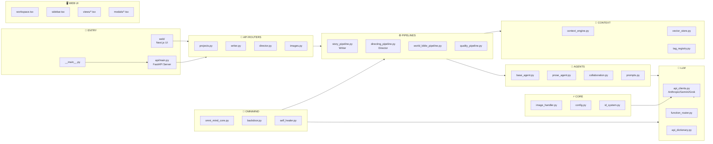

# 🏗️ System Overview

> **Project Greenlight** - Complete Architecture at a Glance

---



---

## 📋 Layer Responsibilities

| Layer | Files | Purpose |
|-------|-------|---------|
| **Entry** | `__main__.py`, `api/main.py` | Application bootstrap, FastAPI server |
| **Web UI** | `web/src/components/*` | React/Next.js frontend interface |
| **API** | `greenlight/api/routers/*` | REST endpoints for frontend |
| **Pipelines** | `greenlight/pipelines/*` | Orchestrate multi-step generation |
| **Agents** | `greenlight/agents/*` | Individual LLM-powered workers |
| **Context** | `greenlight/context/*` | World data and tag management |
| **LLM** | `greenlight/llm/*` | API clients and routing |
| **Core** | `greenlight/core/*` | Config, utilities, image handling |
| **OmniMind** | `greenlight/omni_mind/*` | Autonomous AI assistant |

---

## 🔑 Key Paths

```
C:/Users/Nikoles/Documents/Project_Greenlight/
├── greenlight/          # Main Python package
├── web/                 # Next.js frontend
├── Agnostic_Core_OS/    # Backend OS layer
├── projects/            # User projects
├── config/              # App configuration
└── Diagrams/            # This documentation
```


