```mermaid
flowchart LR
    subgraph INPUT["📥 INPUT"]
        P["pitch.md<br/>Story Concept"]
    end

    subgraph WRITER["✍️ WRITER PIPELINE<br/>story_pipeline.py"]
        W1["consensus_tagger.py<br/>━━━━━━━━━━━━━━<br/>extract_tags()<br/>5 Haiku Agents"]
        W2["world_bible_pipeline.py<br/>━━━━━━━━━━━━━━<br/>generate_profiles()<br/>Character/Location/Prop"]
        W3["quality_pipeline.py<br/>━━━━━━━━━━━━━━<br/>validate()<br/>Quality Checks"]
        W4["telescope_agent.py<br/>━━━━━━━━━━━━━━<br/>assemble()<br/>Claude Sonnet 4.5"]
        
        W1 --> W2 --> W3 --> W4
    end

    subgraph WRITER_OUT["📄 WRITER OUTPUT"]
        WO1["world_config.json<br/>Characters, Locations,<br/>Props, Style"]
        WO2["scripts/script.md<br/>Scene-notated Script"]
    end

    subgraph DIRECTOR["🎬 DIRECTOR PIPELINE<br/>directing_pipeline.py"]
        D1["shot_list_extractor.py<br/>━━━━━━━━━━━━━━<br/>parse_scenes()<br/>Scene Parsing"]
        D2["shot_pipeline.py<br/>━━━━━━━━━━━━━━<br/>generate_frames()<br/>Frame Division"]
        D3["Visual Prompt Agents<br/>━━━━━━━━━━━━━━<br/>generate_prompts()<br/>scene.frame.camera"]
        
        D1 --> D2 --> D3
    end

    subgraph DIRECTOR_OUT["📋 DIRECTOR OUTPUT"]
        DO1["visual_script.json<br/>Frame Data"]
        DO2["storyboard/prompts.json<br/>Editable Prompts"]
    end

    subgraph REFERENCE["📸 REFERENCE GEN<br/>unified_reference_script.py"]
        R1["generate_character_sheet()"]
        R2["generate_location_views()"]
        R3["generate_prop_sheet()"]
    end

    subgraph REF_OUT["🖼️ REFERENCES"]
        RO1["references/CHAR_*/"]
        RO2["references/LOC_*/"]
        RO3["references/PROP_*/"]
    end

    subgraph STORYBOARD["🎨 STORYBOARD<br/>image_handler.py"]
        S1["generate_image()<br/>━━━━━━━━━━━━━━<br/>Seedream 4.5<br/>Blank-First Method"]
    end

    subgraph FINAL["🎞️ OUTPUT"]
        F["storyboard_output/<br/>1.1.cA.png<br/>1.1.cB.png<br/>..."]
    end

    INPUT --> WRITER
    WRITER --> WRITER_OUT
    WRITER_OUT --> DIRECTOR
    WRITER_OUT --> REFERENCE
    DIRECTOR --> DIRECTOR_OUT
    REFERENCE --> REF_OUT
    DIRECTOR_OUT --> STORYBOARD
    REF_OUT --> STORYBOARD
    STORYBOARD --> FINAL
```

# ⚙️ Pipeline Data Flow

> **End-to-End Generation** - From Pitch to Storyboard

---

---

## 📊 Pipeline Functions Reference

| Pipeline | File | Key Functions |
|----------|------|---------------|
| **Writer** | `story_pipeline.py` | `run()`, `generate_story()`, `finalize_script()` |
| **World Bible** | `world_bible_pipeline.py` | `generate_profiles()`, `expand_character()`, `expand_location()` |
| **Quality** | `quality_pipeline.py` | `validate()`, `check_continuity()`, `verify_tags()` |
| **Director** | `directing_pipeline.py` | `run()`, `process_scene()`, `generate_visual_script()` |
| **Shot** | `shot_pipeline.py` | `generate_frames()`, `create_camera_angles()` |
| **Reference** | `unified_reference_script.py` | `generate_character_sheet()`, `generate_location_views()` |
| **Image** | `image_handler.py` | `generate_image()`, `get_style_suffix()` |

