```mermaid
flowchart TB
    subgraph BASE["📦 BASE CLASSES"]
        BA["base_agent.py<br/>━━━━━━━━━━━━━━<br/>BaseAgent<br/>• run()<br/>• generate()<br/>• validate()"]
        AP["agent_pool.py<br/>━━━━━━━━━━━━━━<br/>AgentPool<br/>• get_agent()<br/>• release()<br/>• create_pool()"]
        OR["orchestrator.py<br/>━━━━━━━━━━━━━━<br/>AgentOrchestrator<br/>• orchestrate()<br/>• assign_task()"]
    end

    subgraph COLLAB["🤝 COLLABORATION"]
        CO["collaboration.py<br/>━━━━━━━━━━━━━━<br/>AgentCollaboration<br/>• collaborate()<br/>• vote()<br/>• consensus()"]
    end

    subgraph WRITING["✍️ WRITING AGENTS"]
        PR["prose_agent.py<br/>━━━━━━━━━━━━━━<br/>ProseAgent<br/>• generate_prose()<br/>• refine()"]
        SO["scene_outline_agent.py<br/>━━━━━━━━━━━━━━<br/>SceneOutlineAgent<br/>• create_outline()<br/>• structure_scene()"]
        BE["beat_extractor.py<br/>━━━━━━━━━━━━━━<br/>BeatExtractor<br/>• extract_beats()<br/>• parse_structure()"]
        DC["dialogue_consensus.py<br/>━━━━━━━━━━━━━━<br/>DialogueConsensus<br/>• generate_dialogue()<br/>• roleplay()"]
        BR["brainstorm_agents.py<br/>━━━━━━━━━━━━━━<br/>BrainstormAgent<br/>• brainstorm()<br/>• ideate()"]
    end

    subgraph ASSEMBLY["🔧 ASSEMBLY AGENTS"]
        AA["assembly_agents.py<br/>━━━━━━━━━━━━━━<br/>AssemblyAgent<br/>• assemble()<br/>• merge_outputs()"]
        TT["task_translator.py<br/>━━━━━━━━━━━━━━<br/>TaskTranslator<br/>• translate()<br/>• parse_task()"]
    end

    subgraph REFERENCE["📸 REFERENCE AGENTS"]
        RP["reference_prompt_agent.py<br/>━━━━━━━━━━━━━━<br/>ReferencePromptAgent<br/>• build_character_prompt()<br/>• build_location_prompt()<br/>• build_prop_prompt()"]
        PT["profile_template_agent.py<br/>━━━━━━━━━━━━━━<br/>ProfileTemplateAgent<br/>• analyze_image()<br/>• extract_features()<br/>• map_to_profile()"]
    end

    subgraph VALIDATION["✅ VALIDATION AGENTS"]
        SV["shot_list_validator.py<br/>━━━━━━━━━━━━━━<br/>ShotListValidator<br/>• validate_shots()<br/>• check_continuity()"]
        SJ["steal_list_judge.py<br/>━━━━━━━━━━━━━━<br/>StealListJudge<br/>• judge()<br/>• score()"]
    end

    subgraph PROMPTS["📝 PROMPT LIBRARY"]
        PL["prompts.py<br/>━━━━━━━━━━━━━━<br/>AgentPromptLibrary<br/>• TAG_NAMING_RULES<br/>• SCENE_FORMAT<br/>• CAMERA_INSTRUCTIONS"]
    end

    BASE --> COLLAB
    BASE --> WRITING
    BASE --> ASSEMBLY
    BASE --> REFERENCE
    BASE --> VALIDATION
    PROMPTS --> WRITING
    PROMPTS --> REFERENCE
```

# 🤖 Agents Reference

> **All Agents with Functions** - LLM-Powered Workers

---

---

## 📋 Agent Function Quick Reference

| Agent | File | Key Functions | Used By |
|-------|------|---------------|---------|
| **BaseAgent** | `base_agent.py` | `run()`, `generate()` | All agents |
| **AgentPool** | `agent_pool.py` | `get_agent()`, `release()` | Orchestrator |
| **ProseAgent** | `prose_agent.py` | `generate_prose()` | Writer Pipeline |
| **SceneOutlineAgent** | `scene_outline_agent.py` | `create_outline()` | Writer Pipeline |
| **DialogueConsensus** | `dialogue_consensus.py` | `generate_dialogue()` | Writer Pipeline |
| **ReferencePromptAgent** | `reference_prompt_agent.py` | `build_character_prompt()` | Reference Gen |
| **ProfileTemplateAgent** | `profile_template_agent.py` | `analyze_image()` | Reference Gen |
| **ShotListValidator** | `shot_list_validator.py` | `validate_shots()` | Director Pipeline |

