```mermaid
flowchart LR
    subgraph CALLERS["🔧 CALLERS"]
        A1["Agents"]
        A2["Pipelines"]
        A3["OmniMind"]
        A4["Quality Patterns"]
    end

    subgraph ROUTING["🔀 ROUTING"]
        R1["function_router.py<br/>━━━━━━━━━━━━━━<br/>FunctionRouter<br/>• route()<br/>• get_model_for_function()"]
        R2["llm_config.py<br/>━━━━━━━━━━━━━━<br/>LLMManager<br/>• get_provider()<br/>• configure()"]
        R3["llm_registry.py<br/>━━━━━━━━━━━━━━<br/>ModelRegistry<br/>• register()<br/>• lookup()"]
    end

    subgraph DICTIONARY["📖 API DICTIONARY<br/>api_dictionary.py"]
        subgraph TEXT["Text Models"]
            T1["@LLM_CLAUDE<br/>claude-sonnet-4-5-20250514"]
            T2["@LLM_HAIKU<br/>claude-3-5-haiku-20241022"]
            T3["@LLM_GEMINI<br/>gemini-2.5-flash-preview-05-20"]
            T4["@LLM_GEMINI_PRO<br/>gemini-3-pro-preview"]
            T5["@LLM_GROK<br/>grok-4"]
        end
        subgraph IMAGE["Image Models"]
            I1["@IMG_SEEDREAM<br/>bytedance/seedream-4.5"]
            I2["@IMG_NANO_BANANA<br/>gemini-2.5-flash-image"]
            I3["@IMG_FLUX_KONTEXT<br/>flux-kontext-pro"]
        end
    end

    subgraph CLIENTS["🔌 API CLIENTS<br/>api_clients.py"]
        C1["AnthropicClient<br/>━━━━━━━━━━━━━━<br/>• generate_text()<br/>• stream()"]
        C2["GeminiClient<br/>━━━━━━━━━━━━━━<br/>• generate_text()<br/>• generate_image()"]
        C3["GrokClient<br/>━━━━━━━━━━━━━━<br/>• generate_text()<br/>• (fallback)"]
        C4["ReplicateClient<br/>━━━━━━━━━━━━━━<br/>• generate_image()<br/>• run_model()"]
    end

    subgraph PROVIDERS["☁️ EXTERNAL APIs"]
        P1["Anthropic API"]
        P2["Google AI API"]
        P3["xAI API"]
        P4["Replicate API"]
    end

    CALLERS --> ROUTING
    ROUTING --> DICTIONARY
    DICTIONARY --> CLIENTS
    C1 --> P1
    C2 --> P2
    C3 --> P3
    C4 --> P4
```

# 🔮 LLM Layer

> **API Clients & Routing** - Model Management

---



---

## 📋 Hardcoded Model Usage

| Use Case | Model | Symbol | File |
|----------|-------|--------|------|
| **Consensus Voting** | Claude 3.5 Haiku | `@LLM_HAIKU` | `consensus_tagger.py` |
| **Full Context Assembly** | Claude Sonnet 4.5 | `@LLM_CLAUDE` | `telescope_agent.py` |
| **World Building** | Claude Sonnet 4.5 | `@LLM_CLAUDE` | `world_bible_pipeline.py` |
| **World Building Fallback** | Gemini 3 Pro | `@LLM_GEMINI_PRO` | `world_bible_pipeline.py` |
| **OmniMind Background** | Gemini 2.5 Flash | `@LLM_GEMINI` | `gemini_power.py` |
| **Image Generation** | Seedream 4.5 | `@IMG_SEEDREAM` | `image_handler.py` |
| **Content Policy Fallback** | Grok 4 | `@LLM_GROK` | `api_clients.py` |

---

## 🔑 Environment Variables

```bash
# .env file
ANTHROPIC_API_KEY=sk-ant-...
GEMINI_API_KEY=...
GOOGLE_API_KEY=...
XAI_API_KEY=...
REPLICATE_API_TOKEN=...
AGNOSTIC_CORE_MASTER_KEY=...
```


