```mermaid
flowchart TB
    subgraph SOURCES["📂 DATA SOURCES"]
        S1["pitch.md<br/>Story Concept"]
        S2["world_config.json<br/>Characters, Locations,<br/>Props, Style"]
        S3["scripts/script.md<br/>Scene-notated Script"]
        S4["visual_script.json<br/>Frame Prompts"]
    end

    subgraph CONTEXT["🧠 CONTEXT ENGINE<br/>greenlight/context/"]
        CE["context_engine.py<br/>━━━━━━━━━━━━━━<br/>ContextEngine<br/>• get_world_style()<br/>• get_character_context()<br/>• get_location_context()<br/>• get_full_context()"]
        CA["context_assembler.py<br/>━━━━━━━━━━━━━━<br/>ContextAssembler<br/>• assemble_context()<br/>• merge_sources()"]
        CC["context_compiler.py<br/>━━━━━━━━━━━━━━<br/>ContextCompiler<br/>• compile_for_llm()<br/>• format_context()"]
        AD["agent_context_delivery.py<br/>━━━━━━━━━━━━━━<br/>AgentContextDelivery<br/>• inject_context()<br/>• prepare_agent_context()"]
    end

    subgraph STORAGE["💾 STORAGE"]
        VS["vector_store.py<br/>━━━━━━━━━━━━━━<br/>VectorStore<br/>• store()<br/>• search()<br/>• similarity()"]
        KI["keyword_index.py<br/>━━━━━━━━━━━━━━<br/>KeywordIndex<br/>• index()<br/>• search()"]
        TT["thread_tracker.py<br/>━━━━━━━━━━━━━━<br/>ThreadTracker<br/>• track()<br/>• get_history()"]
    end

    subgraph TAGS["🏷️ TAG SYSTEM<br/>greenlight/tags/"]
        CT["consensus_tagger.py<br/>━━━━━━━━━━━━━━<br/>ConsensusTagger<br/>• extract_tags()<br/>5 Haiku Agents<br/>80% Threshold"]
        TP["tag_parser.py<br/>━━━━━━━━━━━━━━<br/>TagParser<br/>• parse_tag()<br/>• extract_all_tags()"]
        TV["tag_validator.py<br/>━━━━━━━━━━━━━━<br/>TagValidator<br/>• validate_format()<br/>• check_prefix()"]
        TR["tag_registry.py<br/>━━━━━━━━━━━━━━<br/>TagRegistry<br/>• register()<br/>• get_by_type()<br/>• get_all()"]
        TRS["tag_reference_system.py<br/>━━━━━━━━━━━━━━<br/>TagReferenceSystem<br/>• link_reference()<br/>• get_reference()"]
        DC["directional_consensus.py<br/>━━━━━━━━━━━━━━<br/>DirectionalConsensus<br/>• get_directions()<br/>N/E/S/W views"]
        SC["spatial_continuity.py<br/>━━━━━━━━━━━━━━<br/>SpatialContinuity<br/>• track_position()<br/>• validate_movement()"]
    end

    subgraph CONSUMERS["🔧 CONSUMERS"]
        AG["All Agents"]
        PI["All Pipelines"]
        OM["OmniMind"]
        RG["Reference Generation"]
    end

    SOURCES --> CONTEXT
    CE --> CA --> CC --> AD
    CONTEXT --> STORAGE
    TAGS --> CONTEXT
    AD --> CONSUMERS
```

# 🧠 Context Engine & Tag System

> **World Data Management** - Context Injection

---



---

## 🏷️ Tag Format Reference

| Prefix | Category | Example | Used For |
|--------|----------|---------|----------|
| `CHAR_` | Characters | `[CHAR_PROTAGONIST]` | People, creatures |
| `LOC_` | Locations | `[LOC_ROYAL_PALACE]` | Places, settings |
| `PROP_` | Props | `[PROP_ANCIENT_KEY]` | Objects, items |
| `CONCEPT_` | Concepts | `[CONCEPT_HONOR]` | Abstract ideas |
| `EVENT_` | Events | `[EVENT_WEDDING]` | Story events |
| `ENV_` | Environment | `[ENV_RAIN]` | Weather, atmosphere |

---

## 📐 Scene.Frame.Camera Notation

```
Format: {scene}.{frame}.c{letter}

Examples:
  1.1.cA  = Scene 1, Frame 1, Camera A
  2.3.cB  = Scene 2, Frame 3, Camera B

Camera Block:
  [1.2.cA] (Wide)
  cA. SHOT_DESCRIPTION. prompt_content...
```


