```mermaid
flowchart TB
    subgraph ENTRY["🚪 ENTRY POINTS"]
        E1["backdoor.py<br/>━━━━━━━━━━━━━━<br/>Port 19847<br/>• execute_command()<br/>• run_e2e_pipeline()"]
        E2["assistant_bridge.py<br/>━━━━━━━━━━━━━━<br/>UI Chat Interface<br/>• process_message()<br/>• get_response()"]
        E3["autonomous_agent.py<br/>━━━━━━━━━━━━━━<br/>Self-Tasking<br/>• run_autonomous()<br/>• create_task()"]
    end

    subgraph CORE["🧿 CORE"]
        C1["omni_mind_core.py<br/>━━━━━━━━━━━━━━<br/>OmniMindCore<br/>• process()<br/>• think()<br/>• act()"]
        C2["omni_mind.py<br/>━━━━━━━━━━━━━━<br/>OmniMind<br/>• chat()<br/>• execute()"]
        C3["gemini_power.py<br/>━━━━━━━━━━━━━━<br/>GeminiPower<br/>• process_background()<br/>• analyze_image()<br/>Uses: Gemini 2.5 Flash"]
    end

    subgraph CONVERSATION["💬 CONVERSATION"]
        CV1["conversation_manager.py<br/>• manage_history()<br/>• get_context()"]
        CV2["memory.py<br/>• store()<br/>• recall()<br/>• forget()"]
        CV3["user_preferences.py<br/>• get_pref()<br/>• set_pref()"]
    end

    subgraph DECISION["🧠 DECISION"]
        D1["decision_engine.py<br/>• decide()<br/>• evaluate_options()"]
        D2["suggestion_engine.py<br/>• suggest()<br/>• prioritize()"]
        D3["self_guidance.py<br/>• guide()<br/>• plan()"]
    end

    subgraph EXECUTION["⚡ EXECUTION"]
        X1["tool_executor.py<br/>━━━━━━━━━━━━━━<br/>• execute_tool()<br/>• run_e2e_pipeline()<br/>• generate_references()"]
        X2["process_library.py<br/>• get_process()<br/>• register()"]
        X3["process_monitor.py<br/>• monitor()<br/>• get_status()"]
    end

    subgraph HEALING["🔧 SELF-HEALING"]
        H1["self_healer.py<br/>• heal()<br/>• diagnose()"]
        H2["self_heal_queue.py<br/>• queue()<br/>• process()"]
        H3["error_handoff.py<br/>• handoff()<br/>• escalate()"]
        H4["error_reporter.py<br/>• report()<br/>• log()"]
    end

    subgraph PROJECT["📁 PROJECT"]
        P1["project_health.py<br/>• check_health()<br/>• validate()"]
        P2["project_primer.py<br/>• load_context()<br/>• prime()"]
        P3["document_tracker.py<br/>• track()<br/>• on_change()"]
    end

    subgraph REGISTRY["📚 REGISTRY"]
        R1["symbolic_registry.py<br/>• register()<br/>• lookup()"]
        R2["vector_cache.py<br/>• cache()<br/>• get()"]
        R3["key_chain.py<br/>• get_key()<br/>• validate()"]
    end

    ENTRY --> CORE
    CORE --> CONVERSATION
    CORE --> DECISION
    DECISION --> EXECUTION
    HEALING --> CORE
    PROJECT --> CORE
    REGISTRY --> CORE
```

# 🧿 OmniMind System

> **Autonomous AI Assistant** - Self-Tasking & Self-Healing

---



---

## 🔨 Backdoor Commands

| Command | Parameters | Description |
|---------|------------|-------------|
| `run_e2e_pipeline` | `llm`, `image_model`, `max_frames`, `dry_run` | Full pipeline execution |
| `generate_reference_images` | `tag_types`, `model`, `overwrite` | Generate references |
| `get_e2e_status` | - | Get pipeline status |
| `wait_for_pipeline` | `pipeline_name`, `timeout_seconds` | Wait for completion |
| `debug_workspace` | - | UI inspection |

---

## 🧪 Testing OmniMind

```bash
# Test tool registration
py test_e2e_tools.py --test tools

# Test dry run (app must be running)
py test_e2e_tools.py --test dry_run

# Full E2E test
py test_e2e_tools.py --test e2e
```


