```mermaid
flowchart TB
    subgraph APP["📱 APP ENTRY<br/>web/src/app/"]
        A1["layout.tsx<br/>Root Layout"]
        A2["page.tsx<br/>Main Page"]
        A3["globals.css<br/>Global Styles"]
    end

    subgraph LAYOUT["🏗️ LAYOUT COMPONENTS<br/>web/src/components/"]
        L1["header.tsx<br/>━━━━━━━━━━━━━━<br/>Top Navigation<br/>• Project selector<br/>• Pipeline buttons"]
        L2["sidebar.tsx<br/>━━━━━━━━━━━━━━<br/>Left Navigation<br/>• View switcher<br/>• Mode selection"]
        L3["workspace.tsx<br/>━━━━━━━━━━━━━━<br/>Main Content Area<br/>• View container<br/>• Dynamic content"]
        L4["assistant-panel.tsx<br/>━━━━━━━━━━━━━━<br/>OmniMind Chat<br/>• Chat interface<br/>• Command input"]
        L5["progress-panel.tsx<br/>━━━━━━━━━━━━━━<br/>Pipeline Status<br/>• Progress bars<br/>• Log display"]
    end

    subgraph VIEWS["👁️ VIEWS<br/>web/src/components/views/"]
        V1["script-view.tsx<br/>━━━━━━━━━━━━━━<br/>Script Display<br/>• Scene cards<br/>• Prompts tab"]
        V2["world-view.tsx<br/>━━━━━━━━━━━━━━<br/>World Bible<br/>• Character cards<br/>• Location cards<br/>• Prop cards"]
        V3["storyboard-view.tsx<br/>━━━━━━━━━━━━━━<br/>Frame Gallery<br/>• Image grid<br/>• Zoom morphing"]
        V4["gallery-view.tsx<br/>━━━━━━━━━━━━━━<br/>Image Gallery<br/>• All images<br/>• Filtering"]
        V5["progress-view.tsx<br/>━━━━━━━━━━━━━━<br/>Pipeline Progress<br/>• Stage tracking<br/>• Logs"]
    end

    subgraph MODALS["🪟 MODALS<br/>web/src/components/modals/"]
        M1["project-modal.tsx<br/>━━━━━━━━━━━━━━<br/>Project Selection<br/>• Create project<br/>• Load project"]
        M2["writer-modal.tsx<br/>━━━━━━━━━━━━━━<br/>Writer Config<br/>• Style settings<br/>• LLM selection"]
        M3["director-modal.tsx<br/>━━━━━━━━━━━━━━<br/>Director Config<br/>• Frame settings<br/>• Camera options"]
        M4["reference-modal.tsx<br/>━━━━━━━━━━━━━━<br/>Reference Gen<br/>• Tag selection<br/>• Image upload"]
        M5["storyboard-modal.tsx<br/>━━━━━━━━━━━━━━<br/>Storyboard Gen<br/>• Frame selection<br/>• Model choice"]
        M6["settings-modal.tsx<br/>━━━━━━━━━━━━━━<br/>App Settings<br/>• API keys<br/>• Preferences"]
    end

    subgraph STATE["📦 STATE<br/>web/src/lib/"]
        S1["store.ts<br/>━━━━━━━━━━━━━━<br/>Zustand Store<br/>• currentProject<br/>• currentView<br/>• pipelineStatus"]
        S2["utils.ts<br/>━━━━━━━━━━━━━━<br/>Utilities<br/>• cn() classnames<br/>• formatters"]
    end

    APP --> LAYOUT
    L3 --> VIEWS
    LAYOUT --> MODALS
    STATE --> VIEWS
    STATE --> MODALS
```

# 🖥️ Web UI Components

> **Next.js Frontend** - React Component Architecture

---



---

## 📋 Component Responsibilities

| Component | File | Purpose |
|-----------|------|---------|
| **Header** | `header.tsx` | Project selection, pipeline launch buttons |
| **Sidebar** | `sidebar.tsx` | View navigation (Script, World, Storyboard, Gallery) |
| **Workspace** | `workspace.tsx` | Dynamic content container for views |
| **AssistantPanel** | `assistant-panel.tsx` | OmniMind chat interface |
| **ProgressPanel** | `progress-panel.tsx` | Pipeline execution status |

---

## 👁️ View Modes

| View | File | Displays |
|------|------|----------|
| **Script** | `script-view.tsx` | `script.md` with scene cards, prompts tab |
| **World** | `world-view.tsx` | `world_config.json` as cards |
| **Storyboard** | `storyboard-view.tsx` | `storyboard_output/` images |
| **Gallery** | `gallery-view.tsx` | All generated images |
| **Progress** | `progress-view.tsx` | Pipeline logs and status |

---

## 🔌 API Endpoints Used

```typescript
// Projects
GET  /api/projects
POST /api/projects

// Pipelines
POST /api/writer/run
POST /api/director/run
GET  /api/pipelines/status

// Images
POST /api/images/generate
GET  /api/images/{project}

// Settings
GET  /api/settings
POST /api/settings
```


