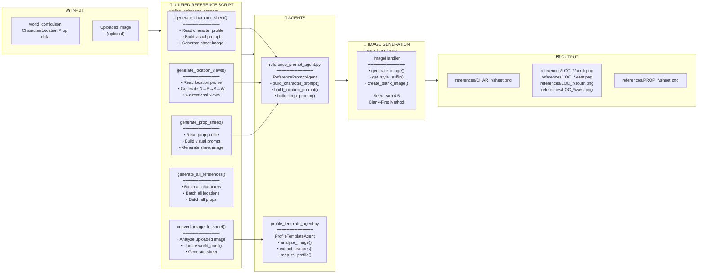

# 📸 Reference Generation

> **Unified Reference Script** - Image Reference Pipeline

---



---

## 📋 Method Reference

| Method | Purpose | Input | Output |
|--------|---------|-------|--------|
| `generate_character_sheet(tag)` | Single character sheet | `[CHAR_NAME]` | `references/CHAR_NAME/sheet.png` |
| `generate_character_from_image(tag, path)` | Analyze image → sheet | Tag + image path | Updated profile + sheet |
| `generate_location_views(tag)` | 4 directional views | `[LOC_NAME]` | N/E/S/W images |
| `generate_prop_sheet(tag)` | Single prop sheet | `[PROP_NAME]` | `references/PROP_NAME/sheet.png` |
| `generate_all_character_sheets()` | Batch all characters | - | All character sheets |
| `generate_all_location_views()` | Batch all locations | - | All location views |
| `generate_all_prop_sheets()` | Batch all props | - | All prop sheets |
| `generate_all_references()` | Everything | - | All references |
| `convert_image_to_sheet(tag, path)` | Image → sheet | Tag + image | Sheet from image |
| `get_reference_status(tag)` | Check status | Tag | Has sheet/views? |

---

## 🎨 Seedream Blank-First Method

```
1. Create blank image at 16:9 2K resolution
2. Insert blank as FIRST image input
3. Add reference images AFTER blank
4. Generate with style suffix from world_config.json
```

---

## 📂 Output Directory Structure

```
projects/{project}/references/
├── CHAR_PROTAGONIST/
│   ├── sheet.png           # Character reference sheet
│   └── key_reference.png   # Starred/key image
├── LOC_PALACE/
│   ├── north.png           # North view
│   ├── east.png            # East view
│   ├── south.png           # South view
│   └── west.png            # West view
└── PROP_SWORD/
    └── sheet.png           # Prop reference sheet
```


