```mermaid
flowchart TB
    subgraph CORE["⚡ CORE<br/>Agnostic_Core_OS/core/"]
        C1["platform.py<br/>━━━━━━━━━━━━━━<br/>Platform<br/>• get_os()<br/>• get_paths()"]
        C2["process_runner.py<br/>━━━━━━━━━━━━━━<br/>ProcessRunner<br/>• run()<br/>• execute()"]
        C3["vector_auth.py<br/>━━━━━━━━━━━━━━<br/>VectorAuth<br/>• authenticate()<br/>• validate()"]
        C4["file_ops.py<br/>━━━━━━━━━━━━━━<br/>FileOps<br/>• read()<br/>• write()"]
        C5["context_logger.py<br/>━━━━━━━━━━━━━━<br/>ContextLogger<br/>• log()<br/>• get_context()"]
    end

    subgraph RUNTIME["🔄 RUNTIME<br/>Agnostic_Core_OS/runtime/"]
        R1["daemon.py<br/>━━━━━━━━━━━━━━<br/>Daemon<br/>• start()<br/>• stop()<br/>• run_background()"]
        R2["event_bus.py<br/>━━━━━━━━━━━━━━<br/>EventBus<br/>• publish()<br/>• subscribe()<br/>• emit()"]
        R3["sdk.py<br/>━━━━━━━━━━━━━━<br/>SDK<br/>• connect()<br/>• call()<br/>• register_app()"]
        R4["health_monitor.py<br/>━━━━━━━━━━━━━━<br/>HealthMonitor<br/>• check()<br/>• report()"]
        R5["app_registry.py<br/>━━━━━━━━━━━━━━<br/>AppRegistry<br/>• register()<br/>• get_app()"]
    end

    subgraph ENGINES["🔧 ENGINES<br/>Agnostic_Core_OS/engines/"]
        E1["image_engine.py<br/>━━━━━━━━━━━━━━<br/>ImageEngine<br/>• process()<br/>• analyze()"]
        E2["audio_engine.py<br/>━━━━━━━━━━━━━━<br/>AudioEngine<br/>• process()<br/>• transcribe()"]
        E3["live_analyze_engine.py<br/>━━━━━━━━━━━━━━<br/>LiveAnalyzeEngine<br/>• analyze_stream()<br/>• detect()"]
        E4["comparison_learning.py<br/>━━━━━━━━━━━━━━<br/>ComparisonLearning<br/>• compare()<br/>• learn()"]
    end

    subgraph MEMORY["💾 MEMORY<br/>Agnostic_Core_OS/memory/"]
        M1["vector_memory.py<br/>━━━━━━━━━━━━━━<br/>VectorMemory<br/>• store()<br/>• retrieve()<br/>• search()"]
        M2["user_profile.py<br/>━━━━━━━━━━━━━━<br/>UserProfile<br/>• get()<br/>• update()"]
        M3["dataset_crafter.py<br/>━━━━━━━━━━━━━━<br/>DatasetCrafter<br/>• craft()<br/>• export()"]
        M4["ui_network.py<br/>━━━━━━━━━━━━━━<br/>UINetwork<br/>• track()<br/>• learn_patterns()"]
    end

    subgraph PROTOCOLS["🔗 PROTOCOLS<br/>Agnostic_Core_OS/protocols/"]
        P1["llm_handshake.py<br/>━━━━━━━━━━━━━━<br/>LLMHandshake<br/>• handshake()<br/>• negotiate()<br/>• establish()"]
        P2["assistant_bridge.py<br/>━━━━━━━━━━━━━━<br/>AssistantBridge<br/>• bridge()<br/>• translate()"]
    end

    subgraph TRANSLATORS["🔄 TRANSLATORS<br/>Agnostic_Core_OS/translators/"]
        T1["vector_language.py<br/>━━━━━━━━━━━━━━<br/>VectorLanguage<br/>• encode()<br/>• decode()<br/>• translate()"]
        T2["systems_translator.py<br/>━━━━━━━━━━━━━━<br/>SystemsTranslator<br/>• translate()<br/>• convert()"]
    end

    subgraph VALIDATORS["✅ VALIDATORS<br/>Agnostic_Core_OS/validators/"]
        V1["iteration_validator.py<br/>━━━━━━━━━━━━━━<br/>IterationValidator<br/>• validate()<br/>• check_iteration()"]
    end

    subgraph ROUTING["🔀 CORE ROUTING<br/>Agnostic_Core_OS/core_routing/"]
        CR1["error_handoff.py<br/>• handoff_error()"]
        CR2["health_logger.py<br/>• log_health()"]
        CR3["vector_cache.py<br/>• cache_vector()"]
    end

    CORE --> RUNTIME
    RUNTIME --> ENGINES
    RUNTIME --> MEMORY
    PROTOCOLS --> RUNTIME
    TRANSLATORS --> PROTOCOLS
    VALIDATORS --> RUNTIME
    ROUTING --> CORE
```

# 🌐 Agnostic_Core_OS

> **Backend OS Layer** - Platform Services

---



---

## 🔗 Integration with Greenlight

```
Greenlight                    Agnostic_Core_OS
─────────                    ─────────────────
runtime_integration.py  ───→  sdk.py
omni_mind/             ───→  omni_mind/
llm/api_clients.py     ───→  protocols/llm_handshake.py
context/vector_store   ───→  memory/vector_memory.py
```

---

## 🧪 Tests

```
Agnostic_Core_OS/tests/
├── proof_of_concept_rag_computation.py
├── proof_of_concept_symbolic_os_feasibility.py
├── proof_of_concept_symbolic_vectoring.py
├── test_engines.py
├── test_memory_system.py
├── test_procedural.py
└── test_vector_llm_handshake.py
```


