```mermaid
flowchart TB
    subgraph ORCHESTRATOR["🎭 ORCHESTRATOR<br/>quality_orchestrator.py"]
        QO["QualityOrchestrator<br/>━━━━━━━━━━━━━━<br/>• orchestrate()<br/>• run_all_validators()<br/>• collect_concerns()"]
    end

    subgraph VALIDATORS["✅ VALIDATION AGENTS<br/>greenlight/patterns/quality/"]
        V1["anchor_agent.py<br/>━━━━━━━━━━━━━━<br/>AnchorAgent<br/>• validate_notation()<br/>• check_tag_format()<br/>• verify_scene_markers()"]
        V2["coherence_validator.py<br/>━━━━━━━━━━━━━━<br/>CoherenceValidator<br/>• check_coherence()<br/>• validate_flow()<br/>• detect_contradictions()"]
        V3["constellation_agent.py<br/>━━━━━━━━━━━━━━<br/>ConstellationAgent<br/>• map_relationships()<br/>• validate_tag_links()<br/>• check_references()"]
        V4["continuity_weaver.py<br/>━━━━━━━━━━━━━━<br/>ContinuityWeaver<br/>• check_continuity()<br/>• track_state()<br/>• validate_transitions()"]
        V5["inquisitor_panel.py<br/>━━━━━━━━━━━━━━<br/>InquisitorPanel<br/>• technical_check()<br/>• validate_format()<br/>• check_notation()"]
        V6["mirror_agent.py<br/>━━━━━━━━━━━━━━<br/>MirrorAgent<br/>• mirror_validate()<br/>• cross_check()<br/>• verify_consistency()"]
    end

    subgraph ASSEMBLY["🔧 ASSEMBLY<br/>greenlight/patterns/quality/"]
        A1["telescope_agent.py<br/>━━━━━━━━━━━━━━<br/>TelescopeAgent<br/>• assemble()<br/>• full_context_review()<br/>• produce_final()<br/><br/>Hardcoded: Claude Sonnet 4.5"]
        A2["universal_context.py<br/>━━━━━━━━━━━━━━<br/>UniversalContext<br/>• get_universal()<br/>• merge_contexts()"]
    end

    subgraph PATTERNS["📐 PATTERNS<br/>greenlight/patterns/"]
        P1["assembly.py<br/>━━━━━━━━━━━━━━<br/>AssemblyPattern<br/>• assemble()<br/>• merge()"]
        P2["steal_list.py<br/>━━━━━━━━━━━━━━<br/>StealListPattern<br/>• extract_steals()<br/>• apply()"]
    end

    subgraph FLOW["🔄 VALIDATION FLOW"]
        F1["Script Input"] --> F2["Run Validators<br/>(Single Pass)"]
        F2 --> F3["Collect Concerns<br/>(No Correction Loops)"]
        F3 --> F4["TelescopeAgent<br/>Full Context Assembly"]
        F4 --> F5["Final script.md"]
    end

    QO --> VALIDATORS
    VALIDATORS --> ASSEMBLY
    ASSEMBLY --> PATTERNS
```

# 🎯 Quality Patterns

> **Validation & Assembly Agents** - Quality Assurance

---



---

## 📋 Validator Responsibilities

| Agent | File | Validates |
|-------|------|-----------|
| **AnchorAgent** | `anchor_agent.py` | Tag notation `[CHAR_NAME]`, scene markers |
| **CoherenceValidator** | `coherence_validator.py` | Story flow, logical consistency |
| **ConstellationAgent** | `constellation_agent.py` | Tag relationships, cross-references |
| **ContinuityWeaver** | `continuity_weaver.py` | State tracking, scene transitions |
| **InquisitorPanel** | `inquisitor_panel.py` | Technical format, notation rules |
| **MirrorAgent** | `mirror_agent.py` | Cross-validation, consistency |
| **TelescopeAgent** | `telescope_agent.py` | Full context assembly (final step) |

---

## 🔑 Key Design Principles

```
1. SINGLE PASS VALIDATION
   - Validators run once, log concerns only
   - No correction loops during validation
   
2. FULL CONTEXT ASSEMBLY
   - TelescopeAgent receives ALL concerns
   - Produces final script.md with fixes
   - Hardcoded to Claude Sonnet 4.5
   
3. SCENE-BY-SCENE CHUNKING
   - Process one scene at a time
   - Maintain scene.frame.camera notation
```

---

## 📐 Notation Validation

```python
# From notation_patterns.py
TAG_PATTERN = r'\[(?:CHAR|LOC|PROP|CONCEPT|EVENT|ENV)_[A-Z0-9_]+\]'
SCENE_FRAME_CAMERA = r'\d+\.\d+\.c[A-Z]'
SCENE_HEADER = r'## Scene \d+:'
```


