```mermaid
flowchart LR
    subgraph PROJECT["📁 projects/{project_name}/"]
        subgraph INPUT["📥 INPUT FILES"]
            I1["pitch.md<br/>━━━━━━━━━━━━━━<br/>Story concept<br/>User-written pitch"]
        end

        subgraph WORLD["🌍 WORLD DATA"]
            W1["world_config.json<br/>━━━━━━━━━━━━━━<br/>• characters: {}<br/>• locations: {}<br/>• props: {}<br/>• visual_style<br/>• style_notes<br/>• lighting<br/>• vibe"]
        end

        subgraph SCRIPTS["📜 SCRIPTS"]
            S1["scripts/script.md<br/>━━━━━━━━━━━━━━<br/>Final scene-notated<br/>script output"]
            S2["scripts/pre_script_outline.md<br/>━━━━━━━━━━━━━━<br/>Intermediate outline<br/>(if needed)"]
        end

        subgraph DIRECTOR["🎬 DIRECTOR OUTPUT"]
            D1["visual_script.json<br/>━━━━━━━━━━━━━━<br/>Frame data with<br/>scene.frame.camera"]
            D2["storyboard/prompts.json<br/>━━━━━━━━━━━━━━<br/>Editable image<br/>prompts"]
        end

        subgraph REFERENCES["📸 REFERENCES"]
            R1["references/CHAR_*/sheet.png"]
            R2["references/LOC_*/N,E,S,W.png"]
            R3["references/PROP_*/sheet.png"]
        end

        subgraph OUTPUT["🎞️ STORYBOARD OUTPUT"]
            O1["storyboard_output/<br/>━━━━━━━━━━━━━━<br/>1.1.cA.png<br/>1.1.cB.png<br/>1.2.cA.png<br/>..."]
        end
    end

    INPUT --> WORLD
    WORLD --> SCRIPTS
    SCRIPTS --> DIRECTOR
    WORLD --> REFERENCES
    DIRECTOR --> OUTPUT
    REFERENCES --> OUTPUT
```

# 📂 Project Files Reference

> **Per-Project File Structure** - Data Files & Outputs

---



---

## 📋 File Purposes

| File | Created By | Used By | Purpose |
|------|------------|---------|---------|
| `pitch.md` | User | Writer Pipeline | Story concept input |
| `world_config.json` | Writer Pipeline | All pipelines | World bible data |
| `scripts/script.md` | Writer Pipeline | Director, UI | Final script |
| `visual_script.json` | Director Pipeline | Storyboard Gen | Frame definitions |
| `storyboard/prompts.json` | Director Pipeline | UI, Storyboard | Editable prompts |
| `references/*/` | Reference Gen | Storyboard Gen | Character/location images |
| `storyboard_output/` | Storyboard Gen | UI | Final frame images |

---

## 🌍 world_config.json Structure

```json
{
  "visual_style": "live_action",
  "style_notes": "Dark cinematic styling...",
  "lighting": "Chiaroscuro with low-key...",
  "vibe": "Intimate, Poetic, Subversive",
  
  "characters": {
    "CHAR_PROTAGONIST": {
      "name": "Character Name",
      "age": "30s",
      "ethnicity": "...",
      "appearance": "...",
      "costume": "...",
      "emotional_tells": "...",
      "physicality": "..."
    }
  },
  
  "locations": {
    "LOC_PALACE": {
      "name": "Royal Palace",
      "description": "...",
      "north_view": "...",
      "east_view": "...",
      "south_view": "...",
      "west_view": "..."
    }
  },
  
  "props": {
    "PROP_SWORD": {
      "name": "Ancient Sword",
      "description": "..."
    }
  }
}
```

---

## 📜 script.md Format

```markdown
## Scene 1: Opening

[1.1.cA] (Wide)
cA. ESTABLISHING SHOT. [LOC_PALACE] exterior at dawn...

[1.1.cB] (Medium)
cB. [CHAR_PROTAGONIST] walks through the gates...

## Scene 2: Confrontation

[2.1.cA] (Close-up)
cA. [CHAR_PROTAGONIST] face, tension visible...
```

---

## 📸 Reference Directory Structure

```
references/
├── CHAR_PROTAGONIST/
│   ├── sheet.png           # Generated character sheet
│   ├── key_reference.png   # User-selected key image
│   └── uploaded_001.png    # User uploads
├── LOC_PALACE/
│   ├── north.png
│   ├── east.png
│   ├── south.png
│   └── west.png
└── PROP_SWORD/
    └── sheet.png
```


